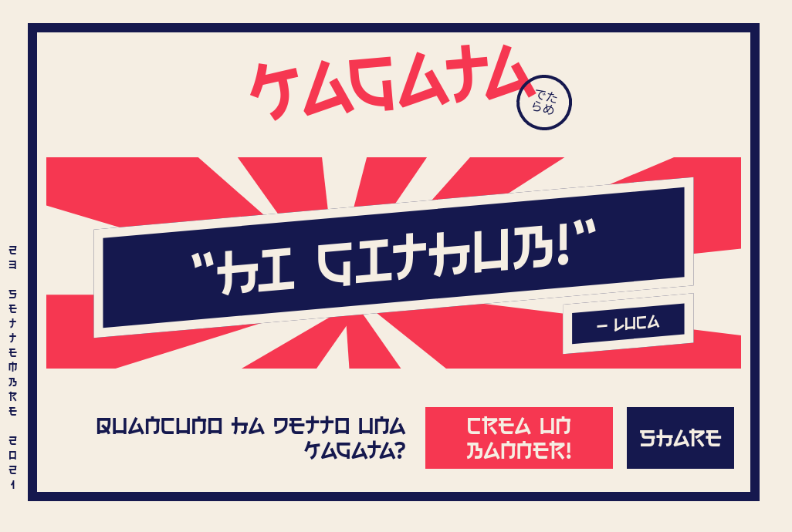

# Kagata

Kagata ("cagata" means bullshit in Italian) lets you create silly banners to share with friends who say a lot of bullshits. Kataga with the "k" because it sound japanese and it make me laugh. [See it live here](http://kagata.netlify.app).

## Up and running

```
npm i
mv .env.dist .env <-- add the endpoint where your are serving from
npm install netlify-cli -g
netlify login
netlify dev
```

## How it woks
It's basically a [SvelteJs](https://svelte.dev/) app that shows a landing page with a form. By compiling the form you will get a url that brings youy to a [Netlify Labda Function](https://www.netlify.com/products/functions/) that generates the banner.

## Example
